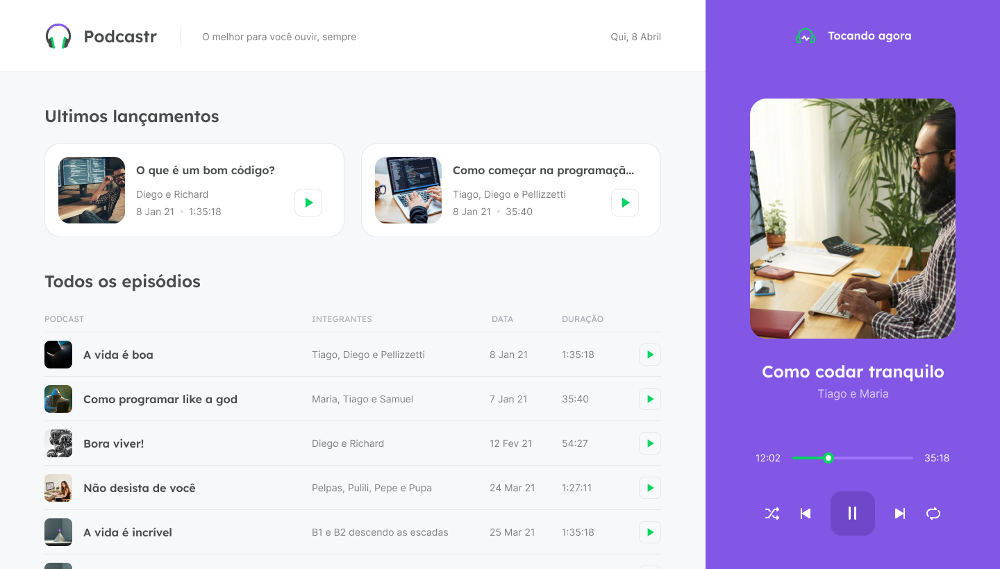

<div align="center">
  <span align="center"> 
    
  </span>
  <h5 align="center">
    PodCastr | O melhor para vocé ouvir sempre
  </h5>
  <h5 align="center">
    Projeto web construído durante o Next Level Week #05 | Trilha ReactJS 
  </h5>
</div>

<p align="center">
  

  

  

  

  
</p>

<p align="center">
  <a href="#descricao">Descrição</a>&nbsp;&nbsp;&nbsp;|&nbsp;&nbsp;&nbsp;
  <a href="#layout">Layout</a>&nbsp;&nbsp;&nbsp;|&nbsp;&nbsp;&nbsp;
  <a href="#tecnologias">Tecnologias</a>&nbsp;&nbsp;&nbsp;|&nbsp;&nbsp;&nbsp;
  <a href="#funcionalidades">Funcionalidades</a>&nbsp;&nbsp;&nbsp;|&nbsp;&nbsp;&nbsp;
  <a href="#instalacao">Instalação</a>&nbsp;&nbsp;&nbsp;|&nbsp;&nbsp;&nbsp;
  <a href="#licenca">Licença</a>
</p>

<h2 id="descricao">:page_facing_up: Descrição</h2>

O Podcastr é uma aplicação web para ouvir podcasts sobre programação produzidos pela RocketSeat.

<h2 id="layout">:art: Layout </h2>

<span align="center"> 
 
 
  Você pode acessar o Layout pelo <a href="https://www.figma.com">Figma</a> através <a href="https://www.figma.com/file/ZGsvRs0PjjI8KARiebR0Xc/Podcastr?node-id=160%3A2761">clicando aqui</a>.
</span>

<h2 id="tecnologias">:hammer: Tecnologias</h2>

Este projeto foi desenvolvido com as seguintes tecnologias

- [Next.js](https://nextjs.org/)
- [React.js](https://pt-br.reactjs.org/)
- [TypeScript](https://www.typescriptlang.org/)
- [Sass](https://sass-lang.com/)

<h2 id="funcionalidades">:clipboard: Funcionalidades </h2>

- [x] Play podcast.
- [x] Selecionar apenas um podcast para ouvir.
- [x] Opção de ir para o próximo podcast.
- [x] Opção de ir para o anterior podcast.
- [x] Opção de Loop.
- [x] Opção para embaralhar.

<h2 id="instalacao">:closed_book: Instalação </h2>

<h3>Pré-requisitos </h3>

<h4>Dependências: </h4>

- [Git](https://git-scm.com)
- [Node.js](https://nodejs.org/pt-br/)

```bash
# Clone este repositório.
$ git clone git@github.com:GustavoSantosCS/Podcastr-frontend.git podcastr

# Vá para a pasta podcastr
$ cd podcastr

# Instale as dependências
$ npm install / yarn install

# Execute aplicação
$ npm run dev / yarn dev

# O app vai está rodando na porta 3000 - acesse <http://localhost:3000>
```

<h2 id="licenca">:memo: Licença </h2>

Copyright © 2020 [Gustavo Santos](https://https://github.com/GustavoSantosCS).
This project is [MIT](./.github/LICENSE) licensed.
